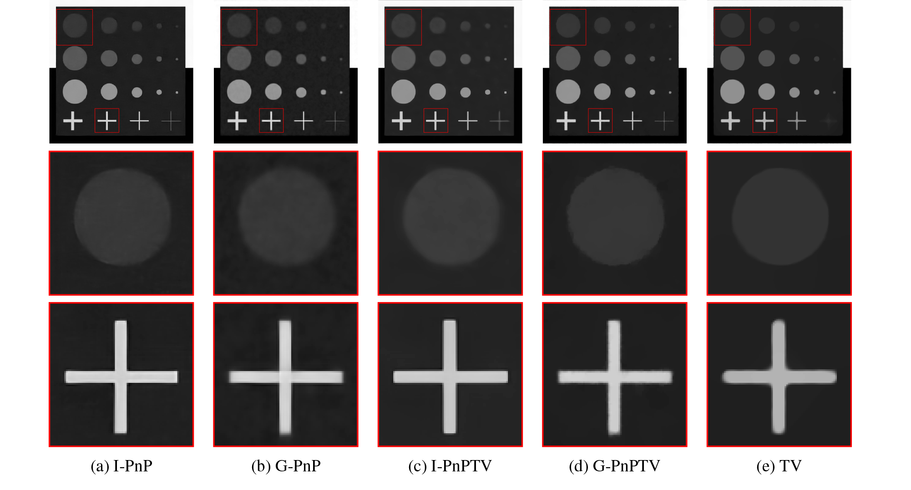

# Plug-and-Play external and internal priors for image restoration

### [Paper (arXiv)](https://arxiv.org/abs/2102.07510) | [Paper (ResearchGate)](https://www.researchgate.net/publication/349335536_Plug-and-Play_external_and_internal_priors_for_image_restoration)

# Abstract
Image restoration problems were traditionally formulated as the minimization of variational models, including data-fidelity and regularization terms, performed by optimization methods with well-established convergence properties. Recently, Plug-and-Play (PnP) methods for image restoration have obtained very good results and popularity by introducing, in iterative proximal algorithms, any off-the-shelf denoiser as priors. Deep Convolutional Neural Network (CNN) denoisers specify external priors (related to an outer training set) which well reflect image statistics; however they fail when dealing with unseen noise variance and image patterns in the given image. Conversely, the so-called internal denoisers induce internal priorsta ilored on the observed data, by forcing specific features on the desired image. We propose a new PnP scheme, based on the Half-Quadratic Splitting proximal algorithm, combining external and internal priors. Moreover, differently from other existing PnP methods, we propose a deep denoiser acting on the image gradient domain. Finally, we prove that a fixed point convergence is guaranteed for the proposed scheme under suitable conditions. In the experimental part, we use CNN denoisers and the Total Variation functional specifying external and internal priors, respectively. We prove the effectiveness of the proposed method in restoring blurred noisy images, both in simulated and real medical settings.

## Image Denoising
 

# Citing
Please consider to cite PnP-TV if you find it helpful.

```BibTex
@article{cascarano2021plug,
  title={Plug-and-Play external and internal priors for image restoration},
  author={Cascarano, Pasquale and Piccolomini, Elena Loli and Morotti, Elena and Sebastiani, Andrea},
  journal={arXiv preprint arXiv:2102.07510},
  year={2021}
}
 ```